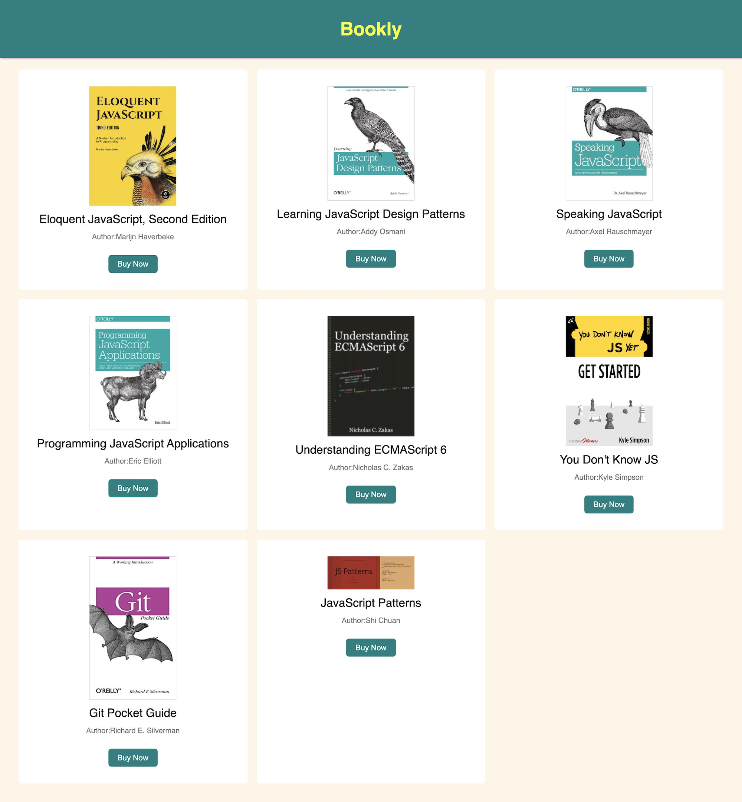

writeCode

#### Follow the instructions to complete this exercise:

1. You will find all the code for this exercise in the `code` folder.
2. Write HTML, CSS and JavaScript in the respective files.
3. Create an app like the layout given below. Find the data to create the app just below the layout.



#### Data for the app

```js
{
  books: [
    {
      isbn: "9781593275846",
      title: "Eloquent JavaScript, Second Edition",
      subtitle: "A Modern Introduction to Programming",
      author: "Marijn Haverbeke",
      published: "2014-12-14T00:00:00.000Z",
      publisher: "No Starch Press",
      pages: 472,
      image: "https://eloquentjavascript.net/img/cover.jpg",
      description:
        "JavaScript lies at the heart of almost every modern web application, from social apps to the newest browser-based games. Though simple for beginners to pick up and play with, JavaScript is a flexible, complex language that you can use to build full-scale applications.",
      website: "http://eloquentjavascript.net/",
    },
    {
      isbn: "9781449331818",
      title: "Learning JavaScript Design Patterns",
      subtitle: "A JavaScript and jQuery Developer's Guide",
      author: "Addy Osmani",
      published: "2012-07-01T00:00:00.000Z",
      publisher: "O'Reilly Media",
      pages: 254,
      image:
        "https://addyosmani.com/resources/essentialjsdesignpatterns/cover/cover.jpg",
      description:
        "With Learning JavaScript Design Patterns, you'll learn how to write beautiful, structured, and maintainable JavaScript by applying classical and modern design patterns to the language. If you want to keep your code efficient, more manageable, and up-to-date with the latest best practices, this book is for you.",
      website:
        "http://www.addyosmani.com/resources/essentialjsdesignpatterns/book/",
    },
    {
      isbn: "9781449365035",
      title: "Speaking JavaScript",
      subtitle: "An In-Depth Guide for Programmers",
      author: "Axel Rauschmayer",
      published: "2014-02-01T00:00:00.000Z",
      publisher: "O'Reilly Media",
      pages: 460,
      image: "http://speakingjs.com/speakingjs_cover.jpg",
      description:
        "Like it or not, JavaScript is everywhere these days-from browser to server to mobile-and now you, too, need to learn the language or dive deeper than you have. This concise book guides you into and through JavaScript, written by a veteran programmer who once found himself in the same position.",
      website: "http://speakingjs.com/",
    },
    {
      isbn: "9781491950296",
      title: "Programming JavaScript Applications",
      subtitle:
        "Robust Web Architecture with Node, HTML5, and Modern JS Libraries",
      author: "Eric Elliott",
      published: "2014-07-01T00:00:00.000Z",
      publisher: "O'Reilly Media",
      pages: 254,
      image: "https://learning.oreilly.com/library/cover/9781491950289/250w/",
      description:
        "Take advantage of JavaScript's power to build robust web-scale or enterprise applications that are easy to extend and maintain. By applying the design patterns outlined in this practical book, experienced JavaScript developers will learn how to write flexible and resilient code that's easier-yes, easier-to work with as your code base grows.",
      website:
        "https://www.oreilly.com/library/view/programming-javascript-applications/9781491950289/",
    },
    {
      isbn: "9781593277574",
      title: "Understanding ECMAScript 6",
      subtitle: "The Definitive Guide for JavaScript Developers",
      author: "Nicholas C. Zakas",
      published: "2016-09-03T00:00:00.000Z",
      publisher: "No Starch Press",
      pages: 352,
      image:
        "https://d2sofvawe08yqg.cloudfront.net/understandinges6/small?1558023536",
      description:
        "ECMAScript 6 represents the biggest update to the core of JavaScript in the history of the language. In Understanding ECMAScript 6, expert developer Nicholas C. Zakas provides a complete guide to the object types, syntax, and other exciting changes that ECMAScript 6 brings to JavaScript.",
      website: "https://leanpub.com/understandinges6/read",
    },
    {
      isbn: "9781491904244",
      title: "You Don't Know JS",
      subtitle: "ES6 & Beyond",
      author: "Kyle Simpson",
      published: "2015-12-27T00:00:00.000Z",
      publisher: "O'Reilly Media",
      pages: 278,
      image:
        "https://github.com/getify/You-Dont-Know-JS/raw/2nd-ed/get-started/images/cover.png",
      description:
        "No matter how much experience you have with JavaScript, odds are you don’t fully understand the language. As part of the 'You Don’t Know JS' series, this compact guide focuses on new features available in ECMAScript 6 (ES6), the latest version of the standard upon which JavaScript is built.",
      website:
        "https://github.com/getify/You-Dont-Know-JS/blob/2nd-ed/get-started/README.md",
    },
    {
      isbn: "9781449325862",
      title: "Git Pocket Guide",
      subtitle: "A Working Introduction",
      author: "Richard E. Silverman",
      published: "2013-08-02T00:00:00.000Z",
      publisher: "O'Reilly Media",
      pages: 234,
      image:
        "https://images-na.ssl-images-amazon.com/images/I/41hZDooM2zL._SX302_BO1,204,203,200_.jpg",
      description:
        "This pocket guide is the perfect on-the-job companion to Git, the distributed version control system. It provides a compact, readable introduction to Git for new users, as well as a reference to common commands and procedures for those of you with Git experience.",
      website:
        "https://www.amazon.com/Git-Pocket-Guide-Working-Introduction/dp/1449325866",
    },
    {
      isbn: "9781449337711",
      title: "JavaScript Patterns",
      subtitle: "JavaScript Patterns",
      author: "Shi Chuan",
      published: "2014-04-07",
      publisher: "Github",
      pages: 538,
      image:
        "https://shichuan.github.io/javascript-patterns/img/js-patterns.png",
      description:
        "A JavaScript pattern and antipattern collection that covers function patterns, jQuery patterns, jQuery plugin patterns, design patterns, general patterns, literals and constructor patterns, object creation patterns, code reuse patterns, DOM and browser patterns",
      website: "https://shichuan.github.io/javascript-patterns/",
    },
  ],
};
```
