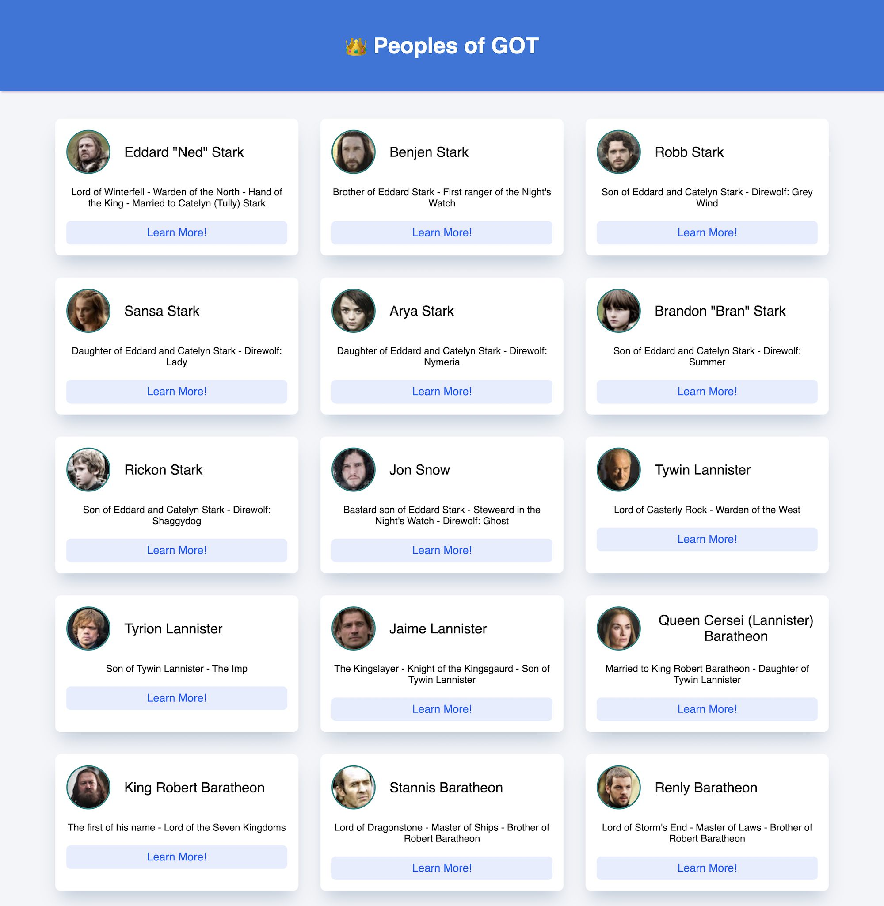

writeCode

## Follow the instructions to complete this exercise:

1. You will find all the code for this exercise in the `code` folder.
2. Write HTML, CSS and JavaScript in the respective files.
3. The data for the app is present in the `data.js` file.
4. The `data.js` file is linked to the `index.html` file. You can access the `got` varaible.
5. Create an app like the layout given below.

